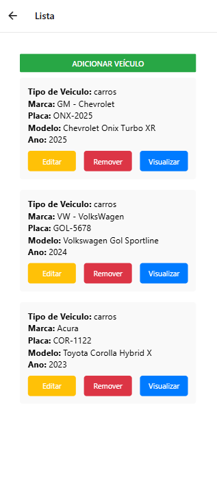
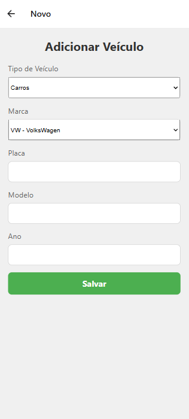

# APP_Veiculos_React_Native 

 

Aplicativo simples de cadastro de veículos (CRUD) com React Native utilizando uma API REST.

**No vscode primeiro execute o seguinte comando para instalar o npm: npm install.**

**Para rodar a aplicação, execute o seguinte comando no VSCode: npx expo start.**

Isso gerará um QR Code que deverá ser escaneado no aplicativo Expo Go, disponível na Play Store. Além disso, há outras opções de teste, como no navegador da web, pressionando a tecla 'W', ou no emulador do Android, pressionando a tecla 'A'. Após executar o comando npx expo start, as opções de execução serão exibidas.
